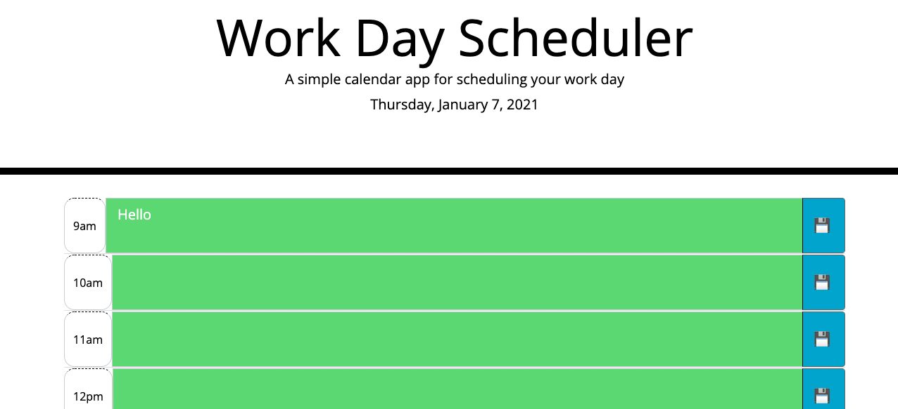

# jasdjames-scheduler-api-homework

## resources 

![Date-fns ] (https://youtu.be/9YZIQAmgD0o)
![Luxon-YouTube] (https://www.youtube.com/watch?v=U4GJA7pY0O0&t=300s)

Luxon and JQuery documentation - for math and add class 
## Description
The intended purpose of this project to create a daily scheduler that would utilize the monent.js or time api to (I used luxon) so that the user can schedule their day that will save to the local storage. 

Installation
This project is listed in the the GitHub repostitory at this is link [GitHub Repository] (https://github.com/jasdjames/jasdjames-scheduler-api-homework)

This page has been deployed here [Page] (https://jasdjames.github.io/jasdjames-scheduler-api-homework/)

 

Usage
The page functions as it should. It was a difficult task and I reached out to my instructor and classmates to collaborate on the more difficult parts. I have sited direction portions in which I received assistance in js file. 

Credits
Erum was someone to bounce idea off of and Will helped in a place where I found myself completely stuck. I appreciate this assignment because I can see myself growing as a developer and am able to identify placed where I need help more easily. 

References

[W3Schools-Operators] https://www.w3schools.com/js/js_comparisons.asp

[Conditional statements] https://www.w3schools.com/js/js_if_else.asp#:~:text=Use%20if%20to%20specify%20a,the%20first%20condition%20is%20false

![Date-fns ] (https://youtu.be/9YZIQAmgD0o)

![Luxon-YouTube] (https://www.youtube.com/watch?v=U4GJA7pY0O0&t=300s)

Luxon and JQuery documentation - for math and add class 

(https://api.jquery.com/parent/)

License
MIT License

Copyright (c) [2020] [JasDJames]

Permission is hereby granted, free of charge, to any person obtaining a copy of this software and associated documentation files (the "Software"), to deal in the Software without restriction, including without limitation the rights to use, copy, modify, merge, publish, distribute, sublicense, and/or sell copies of the Software, and to permit persons to whom the Software is furnished to do so, subject to the following conditions:

The above copyright notice and this permission notice shall be included in all copies or substantial portions of the Software.

THE SOFTWARE IS PROVIDED "AS IS", WITHOUT WARRANTY OF ANY KIND, EXPRESS OR IMPLIED, INCLUDING BUT NOT LIMITED TO THE WARRANTIES OF MERCHANTABILITY, FITNESS FOR A PARTICULAR PURPOSE AND NONINFRINGEMENT. IN NO EVENT SHALL THE AUTHORS OR COPYRIGHT HOLDERS BE LIABLE FOR ANY CLAIM, DAMAGES OR OTHER LIABILITY, WHETHER IN AN ACTION OF CONTRACT, TORT OR OTHERWISE, ARISING FROM, OUT OF OR IN CONNECTION WITH THE SOFTWARE OR THE USE OR OTHER DEALINGS IN THE SOFTWARE.